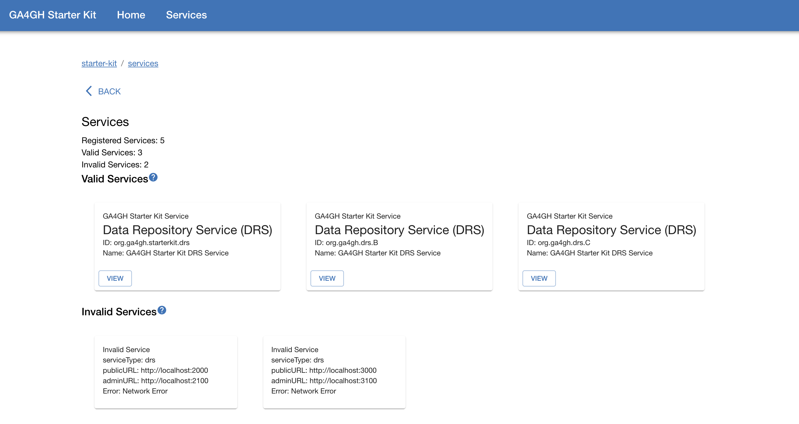
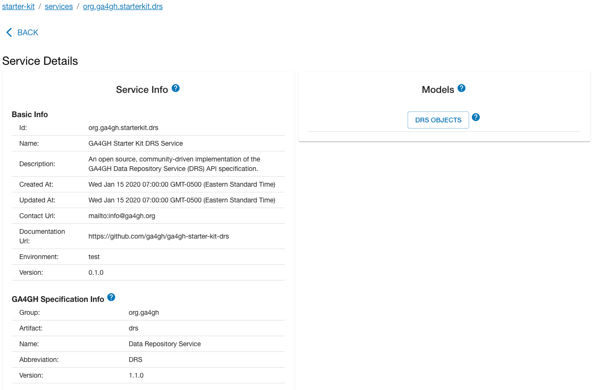

Current Starter Kit UI Release/Tag **0.2.1**

## Install
Use [DockerHub](https://hub.docker.com/repository/docker/ga4gh/ga4gh-starter-kit-ui) to pull the latest Starter Kit UI Docker image: 
```
docker image pull ga4gh/ga4gh-starter-kit-ui:0.2.1
```

[Browse list of available tags](https://hub.docker.com/repository/docker/ga4gh/ga4gh-starter-kit-ui/tags)

## Usage

### Default Configuration 
Run with default Starter Kit UI service configuration properties
``` 
docker run -p 8989:8989 ga4gh/ga4gh-starter-kit-ui:0.2.1
```
Note: `8989` is the UI server's default port
### Custom Configuration
Run with custom Starter Kit UI configuration: 
```
docker run \
    -p ${HOST_PORT}:${CONTAINER_PORT} \
    -v ${HOST_CONFIG_DIR}:/config \
    ga4gh/ga4gh-starter-kit-ui:0.2.1 \
    -c /config/${CONFIG_FILE}
```

where:
* `CONTAINER_PORT`: The port within the Docker container that the app will run on, which should correspond to the `port` property defined in the YAML config file
* `HOST_PORT`: The mapped port on the host machine
* `HOST_CONFIG_DIR`: The absolute file path to the directory containing the YAML configuration file
* `CONFIG_FILE`: The name of the YAML configuration file mounted to the container

## Configuration
The Starter Kit UI app can be configured to load, render and manipulate data models from GA4GH Starter Kit Web Services that are running within a local network or over the web. All property configuration is done via a YAML config file that is supplied to the program at runtime via a `-c ${CONFIG_FILE}` command line option.

The config file MUST start with a single root object named `starterKitUI`. All sub-properties are nested under `starterKitUI`.

### `starterKitUI` Properties: 
|Name|Description|Data Type|Example|
|----|-----------|---------|-------|
|port|The port that the app will run on.|`integer`|`8989`|
|services|A list of running GA4GH Starter Kit services that the UI will reference and load data from.|[`serviceConfig`] array|||

### `serviceConfig` Properties:
|Name|Description|Data Type|Example|
|----|-----------|---------|-------|
|serviceType|The canonical GA4GH API specification/type of the GA4GH Starter Kit service.|enum [`drs`]|`drs`|
|publicURL|The URL and port serving the service's public, read-only API.|URL|`https://drs1.example.com`|
|adminURL|The URL and port serving the service's private, administrative API.|URL|`https://drs1.example.com:6000`|

### Configuration Example
The code below shows an example YAML configuration file that could be provided for the UI to connect to three Starter Kit DRS services.
```YAML title='config.yml'
starterKitUI:
  port: 4000
  services:
    - serviceType: 'drs'
      publicURL: 'https://drs1.example.com'
      adminURL: 'https://drs1.example.com:6000'
    - serviceType: 'drs'
      publicURL: 'https://drs2.example.com'
      adminURL: 'https://drs2.example.com:7000'
    - serviceType: 'drs'
      publicURL: 'https://drs3.example.com'
      adminURL: 'https://drs3.example.com:8001'
```
### Default Configuration
If a configuration file is not provided, the default configuration is used instead. In this case, the Starter Kit UI runs on port `8989` and a single DRS service is loaded using publicURL `http://localhost:4500` and adminURL `http://localhost:8080`. i.e. the YAML equivalent of the default configuration would be:

```
starterKitUI:
  port: 8989
  services:
    - serviceType: 'drs'
      publicURL: 'http://localhost:4500'
      adminURL: 'http://localhost:8080'
```


### Valid and Invalid Services
The GA4GH Starter Kit UI attempts to connect to each of the services defined in the configuration file. If the UI server is able to retrieve the service's `Service Info` (based on base URL and service type), then it is considered valid. If the request is unsuccessful and the service cannot be reached, it is considered invalid. Only valid services can be browsed via the UI. Ensure that the Starter Kit UI configuration file is correct and refer to the [API documentation](../starter-kit-apis/overview.md) to ensure that the service is set up and running correctly.

## UI Pages

Using a web browser, navigate to the URL and port where the Starter Kit UI is running. For example, if the UI service is deployed on your local machine and uses the default port, the URL will be `http://localhost:8989`.

### `/services` - connected Starter Kit Services 

Upon navigating to the Starter Kit UI in a web browser, the GA4GH Starter Kit landing page is displayed. Select Enter to navigate to the GA4GH Starter Kit homepage, then select Get Started to view the available GA4GH Starter Kit services, as shown below. Choose a valid service to view more information about the service and the data models that can be updated using the GA4GH Starter Kit.


_Figure 1: Example `/services` page displaying three valid DRS services and two invalid DRS services. For each valid service, the "View" button navigates to that service's `service-info`, as well as forms for creating and modifying the GA4GH data models the service is responsible for._

### `/services/{serviceId}` - info for a single connected service


_Figure 2: Example `/services/{serviceId}` page displaying information about a single service that the UI connects to. The left panel displays the service's `Service Info`, and the right panel leads to additional pages for editing instances of GA4GH models specific to the service type. In the example the UI is displaying info from a `DRS` service, which has only one editable model, `DRS Object`_

See the links below for more information about the UI modules for the GA4GH Starter Kit APIs:
- [Data Repository Service (DRS) UI](../starter-kit-apis/drs/drs_starter_kit_ui.md)