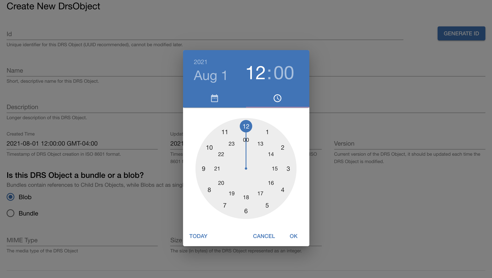
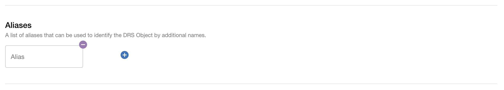
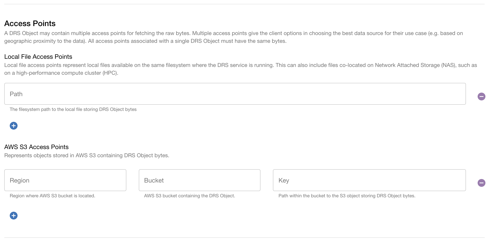
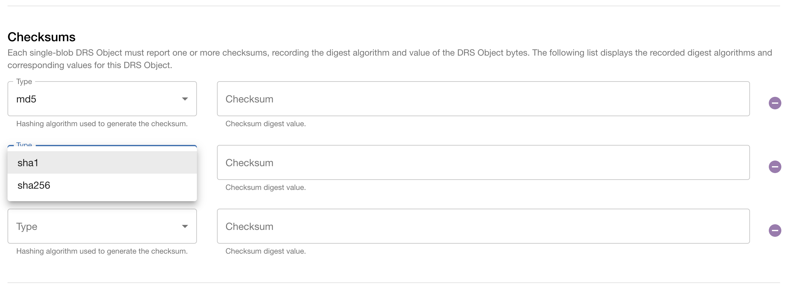
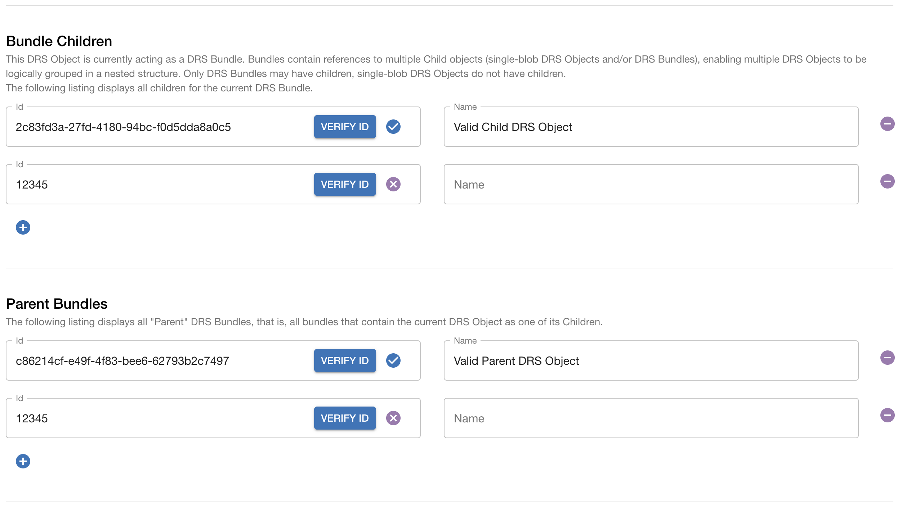
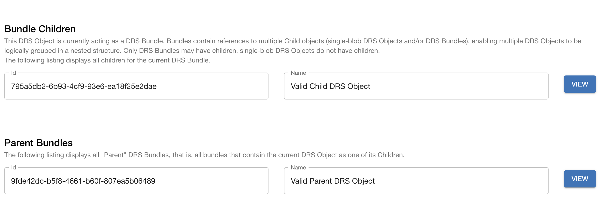

# Editing DRS models via UI

## Setup

The Starter Kit UI can be used to browse and manipulate data models controlled by the Starter Kit DRS service. To work with the UI:
1. Ensure that a [Starter Kit DRS](./drs_overview) service is running
2. Run an instance of the [Starter Kit UI](../../concepts-and-guides/starter_kit_ui), using a configuration file that refers the UI to the running DRS service.
3. Navigate to the URL and port where the UI is running via web browser
4. From the `/services` page, click the `View` button for the connected DRS service

The following DRS-related data models can be edited via the UI
* DRS Object

## Editable Model: DRS Object

### DRS Object Index
**Route:** `/services/{serviceId}/drs/objects`

The DRS Object Index view displays a table of all DRS Objects on the DRS server. Each row represents a single DRS Object. For each DRS Object:
* The "View" button navigates to a read-only form, displaying all info about the DRS Object
* The "Edit" button navigates to an editable form, accepting changes that can be pushed to the server
* The "Delete" button allows the user to delete the object if desired

Lastly, the "New DRS Object" button can be used to add new DRS Objects to the database.

### DRS Object Form

The DRS Object Form displays the properties of a single DRS Object. The DRS Object Form has multiple modes:
* **New** mode: used to create a new DRS Object on the DRS service. All form fields are editable
* **Edit** mode: used to modify attributes of an existing DRS Object on the DRS service. Most fields are editable, some are not
* **View** mode: read-only view to simply display information about an existing DRS Object. All fields are non-editable

#### DRS Object Form Components

##### Id

All DRS Objects must have a unique ID which can be populated by typing in the Id field or by clicking the "Generate ID" button to generate a random UUID. This value cannot be updated after the new DRS Object has been submitted.

##### Name, Description, Version, MIME Type
Name, Description, Version, and MIME Type are optional fields, populated via free text entry. Note that MIME Type is only applicable to Blobs.

##### Created Time and Updated Time
By default, Created Time and Updated Time are populated with the current time, as of when the New DRS Object page is rendered. To update either of these values, click on the field to open a date-time picker. Any date or time can be selected, however, note that seconds cannot be selected and are therefore automatically set to zero. The current date and time can be set by clicking the "Today" button.

_Figure 1: A date-time picker can be used to set the Created Time and Updated Time._

##### Blob or Bundle Selector
Use these radio buttons to identify whether the new DRS Object is a Bundle or a Blob. Note that "Blob" is selected by default. Bundles can have child DRS Objects, while Blobs are single DRS Objects and do not have children. This selection cannot be modified after the DRS Object has been created.

Common Blob and Bundle properties:
- Id
- Name
- Description
- Created Time
- Updated Time
- Version
- Aliases
- Parent Bundles

Blob-only properties:
- MIME Type
- Size
- Checksums
- Local File Access Points
- AWS S3 Access Points 

Bundle-only properties:
- Bundle Children

##### Size
Represents the size of the DRS Object in bytes.

##### Aliases
Zero or more alternate names/labels for the DRS Object.

##### Local File Access Points
Blob-only property. Provides information about a local file containing the bytes for this DRS Object. Assumes that the DRS server has access to the file (i.e. available on local/network filesystem at the indicated path).

##### AWS S3 Access Points
Blob-only property. Provides information about an AWS S3 object containing the bytes for this DRS Object (bucket, path, etc).

_Figure 2: Examples of the Aliases and Access Points fields, including add and remove buttons._

##### Checksums
Each Checksum instance has two fields which must be populated to define the Type and the Checksum value. Checksum instances can be added to the new DRS Object by clicking the add button, or removed by clicking the remove button corresponding to the instance to be removed.

There are three possible Checksum Types which can be selected using the Type dropdown menu shown below: "md5", "sha1", and "sha256". Each Type can only be selected once, and therefore, a maximum of three Checksum objects can be added. Since each Type can only be chosen once, when a Type field has been populated, that option is hidden from the Type dropdown menu of subsequent Checksum objects.

The Checksum field can be updated through free text entry and should represent the Checksum digest value corresponding to the selected Type.

_Figure 3: The Type dropdown menu can be used to select the Checksum Type. Each Type can only be selected once, and therefore once it has been selected, it is hidden from all subsequent Checksum objects._

##### Parent Bundles and Bundle Children
Parent Bundles and Bundle Children represent the relationship between the new DRS Object and other existing DRS Objects. Parent Bundle and Bundle Child instances can be added to the new DRS Object by clicking the add button, or removed by clicking the remove button corresponding to the instance to be removed.

Each Parent and Child object has an Id field and a Name field. The Id field can be populated manually and must be validated by clicking the "Verify ID" button. An Id is determined to be valid if it represents an existing valid DRS Object. Additionally, when adding Parent Bundles, the Id must correspond to another Bundle type DRS Object, as by definition, Blobs cannot have children, and therefore cannot be Parent Bundles. A checkmark icon is displayed to indicate that an Id is valid, while an X icon indicates that the Id is invalid. The Name field cannot be manually updated, but is automatically populated when the corresponding Id is determined to be valid. 

_Figure 4: An example of validation of both valid and invalid sample Parent Bundles and Bundle Children. As shown above, valid related DRS Objects display a checkmark icon, while invalid objects display an X icon._

##### Submit Button
Clicking the "Submit" button will first validate that all of the data in the form is valid, and if so, make an API request to the DRS server to either create a new DRS Object, or update an existing DRS Object with the data in the form. An alert message will display whether the submission successfully created/updated the DRS server or not.

### New DRS Object
**Route:** `/services/{serviceId}/drs/objects/new`

Navigate to the New DRS Object form by clicking the "New DRS Object" button located at the top left-hand side of the [Index](drs_starter_kit_ui.md#index).
To create a new DRS Object, populate the relevant fields displayed on the DRS Object form and click the "Submit" button. Note that all DRS Objects must have a unique ID and must be identified as either a Blob or a Bundle. All other fields are optional. See below for more details about the New DRS Object form fields. 

### View DRS Object
**Route:** `/services/{serviceId}/drs/objects`

DRS Object Form in **View** mode. View all details about a single DRS Object. It is not possible to edit any attributes from the form in "View" mode.

_Figure 5: Each related DRS Object has a "View" button which links to the corresponding View DRS Object page._

### Edit DRS Object
**Route**: `/services/{serviceId}/drs/objects/${drsObjectId}/edit`

DRS Object Form in **Edit** mode. Edit attributes of an existing DRS Object. The object's `id`, and whether it is a blob or bundle are no longer editable. Click "Submit" to submit changes to server.

### Delete DRS Object

A DRS Object can be deleted using the "Delete" button on either the DRS Object Index or DRS Object Form pages.
